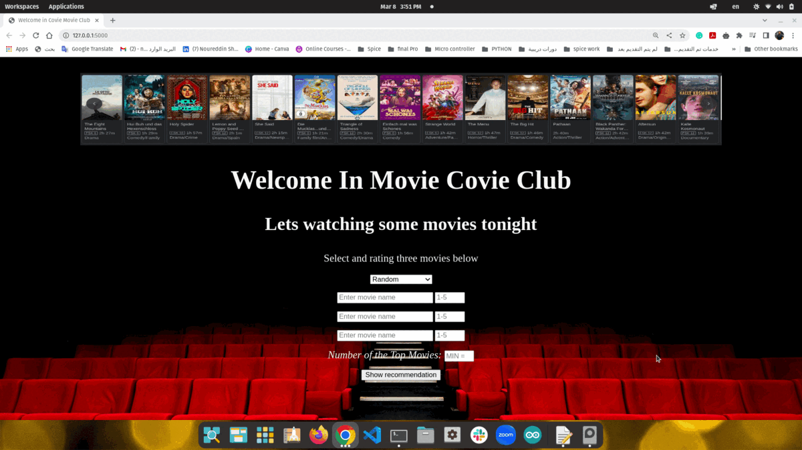

#  Movie Recommender App

Movie Recommender App is a recommendation engine for users based on their past viewing habits. The app uses a small dataset of MovieLens, which includes 100,000 ratings for 9,000 movies by 600 users. Additionally, the app uses movie posters obtained from the OMDb API.

The app implements the following recommender methods:

* Simple Recommender: recommends the most popular movies.
* Non-Negative Matrix Factorization (NMF).
* Collaborative Filtering.

The app is built with Flask, and users can select their favorite movies. The user can rate the selected movies, and the app recommends 5 movies based on the NMF algorithm.

## Requirements
To run the Movie Recommender App, the following requirements are necessary:

* Flask
* matplotlib
* numpy
* pandas
* requests
* scikit_learn

## Installation
1. Clone the repository or download the source code.
2. Install the requirements using pip: pip install -r requirements.txt
3. Run the app using python app_pro.py.
4. Access the app on http://localhost:5000 on your web browser.

## Usage
To use the Movie Recommender App, follow these steps:

1. Access the app on http://localhost:5000 on your web browser.
2. Select your favorite movies from the list.
3. Rate the selected movies.
4. Click on the "Get Recommendations" button.
5. The app will recommend from 1 to 100 top movies based on the NMF algorithm.

## License
The Movie Recommender App is released under the MIT License. 
